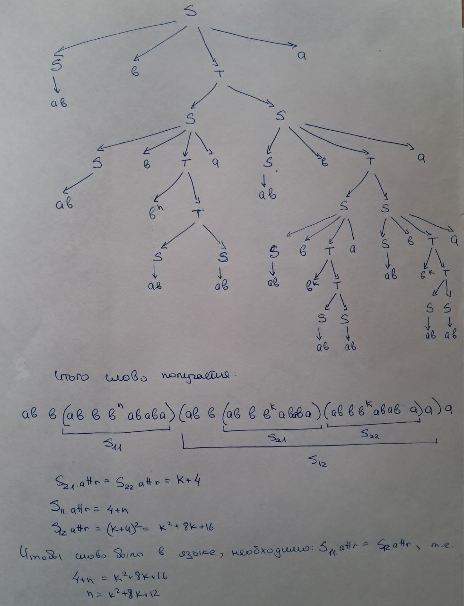
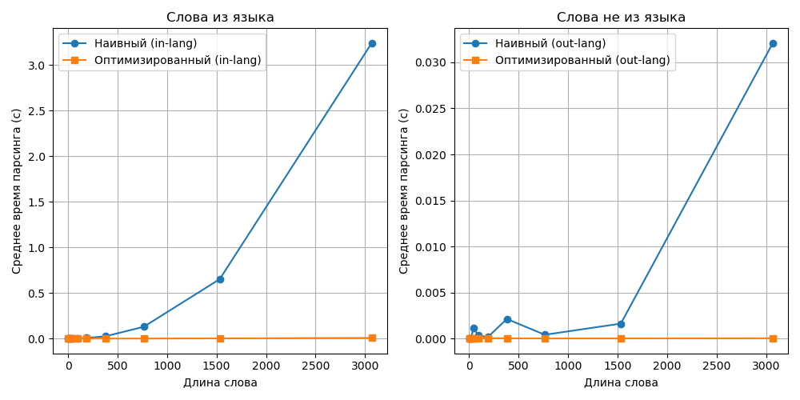

# Лабораторная работа №4
Моя атрибутная грамматика:
| | |
|---|---|
|$S \to SbTa$ | $S_0.a := T.a$|
|$S \to ab$   | $S.a := 2$|
|$S \to ba$   | $S.a := 3$|
|$T \to SS$   | $T.a := S_1.a*S_2.a, S_1.a==S_2.a$|
|$T \to bT$   | $T_0.a := T_1.a+1$|

---
## Анализ на КС и регулярность

Любое слово из данной грамматики имеет вид $S \to (ab|ba)(bb^\*SSa)^\*$, и его атрибут будет равен атрибуту самого последнего $b^\*SS$ (кроме тривиальных случаев, когда слово - это просто ab или ba). Атрибут этого $b^kSS$ (т.е. нетерминала T из изначальной грамматики) равен $x^2+k, k>=0, S_1.a=S_2.a=x$. Тогда получается, что в конце выполнения рекурсии SS в нетериминале T, чтобы слово удовлетворяло грамматике, оба S должны быть либо ab, либо ba (иначе $S_1.a=2 \ne S_2.a=3$), и тогда на самом нижнем шаге рекурсии $T.a=4+k$ или $T.a=9+k$, где k - это количество b в $T=b^kSS$. 

Пересечём данный язык L с регулярным языком $R=a^+b^+a^+b^+a^+b^+a^+b^+a^+b^+a^+b^+a^+b^+a^+b^+a^+b^+a^+b^+a^+b^+a^+$, и возьмём из полученного пересечения P слова вида $abb(abbb^{p^2+8p+12}ababa)(abb(abbb^pababa)(abbb^pababa)a)a$, где p - константа из леммы. Это слово принадлежит языку, потому что получено следующим путём:

Пусть P - КС язык. Тогда по лемме о накачке для КС языков существует константа накачки p.
Возьмём слово: $w = abbabbb^{p^2+8p+12}ababaabbabbb^pababaabbb^pababaaa$.

По лемме существует такое разбиение w = xvwuy, что $|vwu| <= p$, $|vu| > 0$. Т.к. $|vwu| <= p$, то этот отрезок лежит:
1) полностью в блоке $b^{p^2+8p+12}$. При i=0 получается слово $w_0 = abbabbb^{p^2+8p+12-k}ababaabbabbb^pababaabbb^pababaaa, 1<=k<p$. Тогда стало $S_{11}.attr = p^2+8p+16-k$, а $S_{12}.attr = p^2+8p+16$, и значит нарушается условие равенства $S_{11}.attr = S_{12}.attr$. Слово выпало из языка. Противоречие лемме.
2) полностью в каком-либо из двух блоков $b^p$. При i=0 нарушается равенство $S_{21}.attr = S_{22}.attr$. Слово выпало из языка. Противоречие лемме.
3) содержит оба блока $b^p$, т.е. $w=b^tababaabbb^t, 0<=t<(p-6)/2$, $v=b^s$ (из первого $b^p$), $u=b^s$ (из второго $b^p$), $t+s=(p-6)/2$. При i=0 получаем слово $w_0 = abbabbb^{p^2+8p+12}ababaabbabbb^{p-s}ababaabbb^{p-s}ababaaa$. Равенство атрибутов $S_{21}.attr = S_{22}.attr = p-s$ сохранится, да. НО нарушится равенство атрибутов $S_{11}.attr = p^2+8p+16$ и $S_{12}.attr = (p-s+4)^2=p^2+2p(4-s)+(4-s)^2$, что равно только когда s=0, что невозможно. Слово выпало из языка. Противоречие лемме.
4) Как-либо на стыке блока $b^{p^2+8p+12}$ или блока $b^p$ с оставшейся частью слова, или только оставшееся слово (без данных блоков). При i=0 пропадает важная часть слова, и ломается его структура, что выбрасывает слово из языка. Единственный вариант "безболезненно" сделать нулевую накачку - удалить блок bTa из какой-либо части слова, НО это невозможно, потому что его длина заведомо больше p, и более того: нарушится равенство атрибутов.
       

Значит во всех возможных разбиениях w = xvwuy есть i, для которого $xv^iwu^iy$ не принадлежит языку. Это противоречит лемме.
Следовательно язык P не КС. А значит и изначальный язык L не КС.

---
Избавимся от левой рекурсии в грамматике:
| | |
|---|---|
|$S \to abP$  | $S.a := P.a$|
|$S \to baP$  | $S.a := P.a$|
|$S \to ab$   | $S.a := 2$|
|$S \to ba$   | $S.a := 3$|
|$P \to bTa$  | $P.a := T.a$|
|$P \to bTaP$ | $P_0.a := P_1.a$|
|$T \to SS$   | $T.a := S_1.a*S_2.a, S_1.a==S_2.a$|
|$T \to bT$   | $T_0.a := T_1.a+1$|

Оптимизрованный парсер использует мемоизацию: для каждой пары (нетерминал, позиция при входе) результат вычисляется один раз и сохраняется.

Верхняя оценка сложности оптимизированного парсера: $O(n^3)$.
